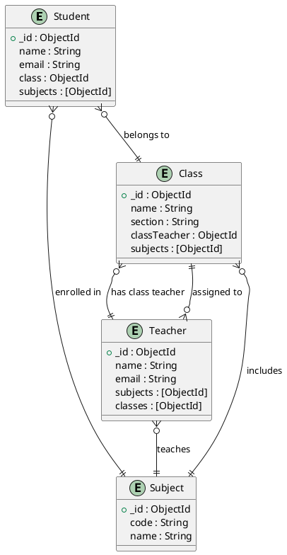
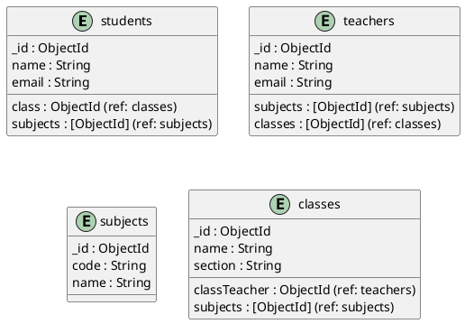

# School Database Management System (DBMS) Project Report

## 1. Introduction
This report documents the technical implementation of a School Management System developed using Express.js (Node.js) and MongoDB. The application manages students, teachers, subjects, and classes, providing CRUD operations and entity relationships typical of a DBMS project.

## 2. Technology Stack
- **Backend:** Express.js (Node.js)
- **Database:** MongoDB (NoSQL)
- **Frontend:** React (Vite)

## 3. Main Entities & Relationships
- **Student**: Belongs to a class, enrolled in multiple subjects.
- **Teacher**: Teaches multiple subjects, assigned to multiple classes.
- **Subject**: Taught by teachers, taken by students, included in classes.
- **Class**: Has a class teacher, includes multiple subjects, contains students.

## 4. Database Schema (MongoDB)
- **students**: `{ _id, name, email, class: ObjectId, subjects: [ObjectId], ... }`
- **teachers**: `{ _id, name, email, subjects: [ObjectId], classes: [ObjectId], ... }`
- **subjects**: `{ _id, code, name, ... }`
- **classes**: `{ _id, name, section, classTeacher: ObjectId, subjects: [ObjectId], ... }`

## 5. ER Diagram

## 6. Schema Diagram

## 7. Key Features
- **CRUD Operations**: Full create, read, update, and delete for all entities.
- **Relationships**: References between collections using ObjectId (MongoDB DBRefs or manual population).
- **Authentication**: (If implemented) Secure login for admin, teachers, and students.
- **Validation**: Data validation at both API and database level.
- **RESTful API**: Modular routes for each entity.

## 8. Technical Implementation
- **Express.js**: Handles API routing, middleware, and business logic.
- **Mongoose**: ODM for MongoDB, defines schemas and relationships.
- **Relationships**: Implemented using ObjectId references and Mongoose population.
- **Error Handling**: Centralized error middleware for API responses.
- **Frontend**: React app for admin dashboard, CRUD forms, and data visualization.

## 9. Diagrams Source (PlantUML)
### ER Diagram (`er-diagram.puml`)

### Schema Diagram (`schema-diagram.puml`)

## 10. Conclusion
This project demonstrates a practical implementation of a DBMS using modern web technologies, focusing on entity relationships, CRUD operations, and schema design. The use of MongoDB and Mongoose allows for flexible, scalable data modeling suitable for educational institutions.
